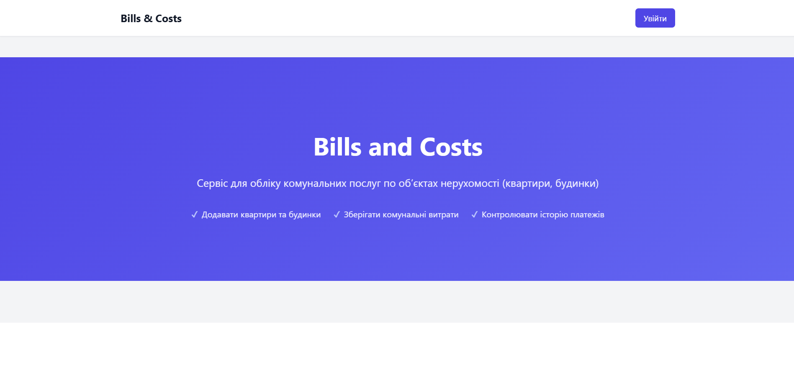
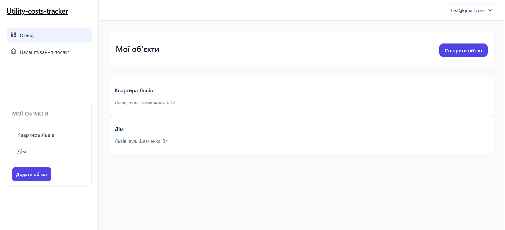
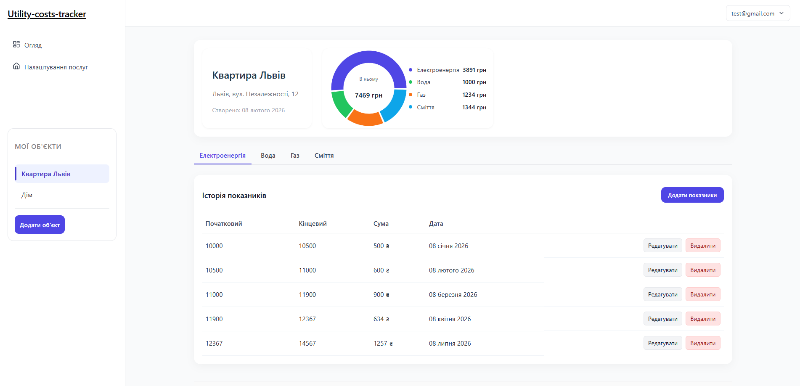
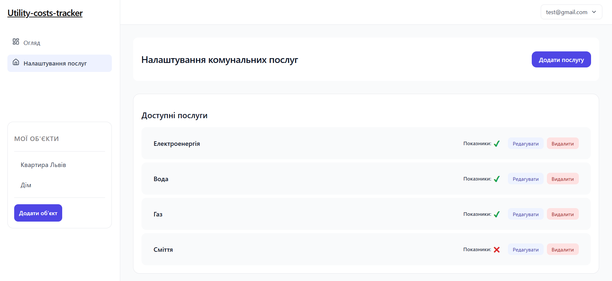

# Utility-costs-tracker
A full-featured dashboard application for tracking utility expenses across multiple real estate properties.
The application allows users to manage properties, submit meter readings, analyze expenses through dynamic charts, and customize utility service types.

## Features
### Authentication
- User registration and login
- Protected routes
- Profile and password settings pages

### Dashboard
- List of real estate properties
- Add new property via modal form
- Quick navigation through layout sidebar
- Dropdown user menu (Profile, Settings, Logout)

### Property Details Page
- Detailed property information
- Tab-based filtering by utility services
- CRUD operations for utility readings
- Modal form for submitting new meter readings
- Summary statistics:
  - First and last submission date
  - Total expenses
  - Total number of readings

### Charts & Analytics
- 📈 Line chart (Chart.js) — expense dynamics over time
- 🥧 Pie chart (Chart.js) — percentage distribution of utility costs

### Utility Services Management
- Add, edit, delete utility service types
- Services dynamically rendered as tabs on property page

### UI & UX
- Responsive design for all screen sizes
- Modular CSS architecture (CSS Modules)
- Layout with sidebar navigation and header dropdown

---

## Tech Stack
**Frontend**
- React
- React Router
- Chart.js

**Styling**
- CSS3
- CSS Modules

**Build Tool**
- Vite

**Package Manager**
- npm

---

## Installation & Setup

Clone the repository:
```bash
  git clone https://github.com/Andrii-hn/Utility-costs-tracker.git
  cd utility-costs-tracker
  npm install
  npm run dev
```
---

Project Structure (Simplified)

```bash
src/
 ├── components/
 ├── pages/
 ├── data/
 ├── utils/
 ├── App.jsx
 └── main.jsx
```
The project follows a component-based architecture with separation of pages, reusable UI components, and layout structure.

## Architecture Overview
- Protected routes implemented using React Router
- State managed locally with React hooks
- Dynamic rendering of utility services
- Data-driven charts based on submitted readings
- Modal-based form handling for CRUD operations

## Future Improvements
- Add backend integration 
- Implement persistent database storage
- Add form validation improvements
- Add unit and integration tests
- Implement role-based access
- Add TypeScript

## Screenshots





## 🚀 Live Demo
https://utility-costs-tracker-app.vercel.app/

## Author
Andrii Hnylytskyi